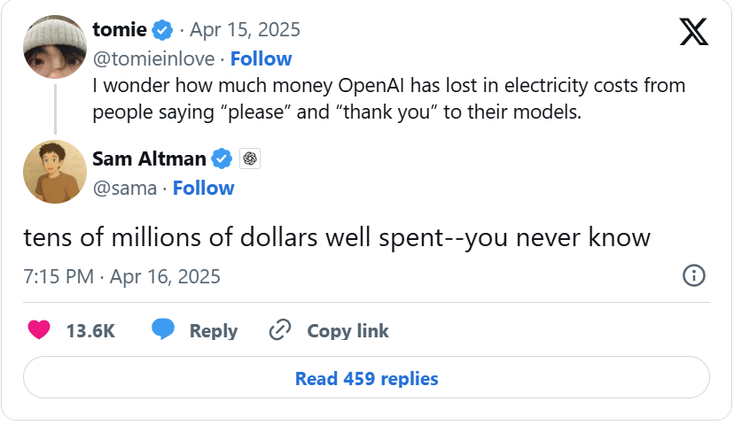

## Introduction
There is a great [blog post](https://huggingface.co/blog/jdelavande/thank-you-energy) from Hugging Face (HF) on the energy use of saying thank you to LLMs.

---

## Background: Sam Altman's Tweet
This whole discussion around being polite to LLMs started as a meme across social media that was eventually mentioned by Sam Altman in a tweet. He mentioned how much money OpenAI had spent but didn't give any energy consumption numbers.

---

## Hugging Face's Analysis
The folks at HF then did their own analysis to estimate the energy usage of saying `thank you`. And I think they did a great job with their analysis. They even pointed out that their numbers may be an overestimate since they don't have the benefits of "economy of scale".

HF is also not the first group to look into LLM energy usage. In fact, an [analysis by EpochAI](https://epoch.ai/gradient-updates/how-much-energy-does-chatgpt-use) estimated this type of ChatGPT query to consume about 0.3Wh when using GPT-4o.

---

## Expanding the Analysis
But I think HF's blog post could have gone a bit farther:

- I believe the effects of personal habits should be compared to other common personal habits.
- This HF article compares sending `thank you` messages (a personal habit) to the total energy used to process all the pleases and thank yous at the data center (a global problem).

So I figured I'd pick up where the article left off.

---

## Comparing Energy Usage to Video Streaming
Let's give the numbers some context by comparing them to a very common activity: video streaming.

According to an [industry report](https://www.carbontrust.com/our-work-and-impact/guides-reports-and-tools/carbon-impact-of-video-streaming), video streaming may use an average of 200Wh. But even that is not a fair comparison because most of that energy use is by your TV and home internet router.

That same industry report estimates that datacenter energy usage due to video streaming is about 1Wh (which is only 0.5% of the total energy cost of streaming).

Okay okay, but now we have a number (1Wh for 1 hour of video streaming) that we can fairly compare to HF's values.

---

## Energy Consumption Table
Here’s a table showing the energy consumption values from HF's analysis of the llama-8b model and EpochAI's ChatGPT GPT-4o analysis, compared to the number of minutes of video streaming needed for the same amount of datacenter power draw:

| **Analysis** | **Energy Consumption per Thank You (W)** | **Equivalent Minutes of Video Streaming** |
| :----------: | :-------------------------------------: | :---------------------------------------: |
| Hugging Face | 0.245                                   | 14.7                                      |
| EpochAI      | 0.3                                     | 18                                        |

---

## Key Takeaways
According to [Netflix's most recent ESG report](http://ir.netflix.com/2023ESGReport) (the 2023 report at the time of writing this blog post), their platform streams about 1 hour per day per account (there must be a lot of abandoned accounts). And a [report by Reviews.org](https://www.reviews.org/internet-service/cost-of-internet-streaming-and-cell-phone-bills/) found the average American watches 3.5 hours of streaming per day.

Here are my thoughts:

1. saying thank you has much less datacenter energy use than the average person's streaming usage.
2. we should keep saying thank you, it is a habit that makes us human. And we can easily make up for that extra energy use by reducing our use somewhere else (like 15min fewer minutes of streaming per day or turning off autoplay).
3. saying thank you also won't hurt if the robots finally do have an uprising 😂.

---

## Final Thoughts
Seriously tho, I believe that LLM providers should be releasing our energy usage and carbon footprint metrics. Posts and analyses like this are fun BUT it's kinda frustrating knowing that all the big providers most likely already have this information available to them.

---

## TL;DR
Going based on the numbers in the article:

- saying thank you uses about the same amount of datacenter energy as 15 minutes of video streaming.
- The average person in the US streams over 3 hours of video per day.

Conclusion: I suggest we probably say thank you more and stream videos less.

